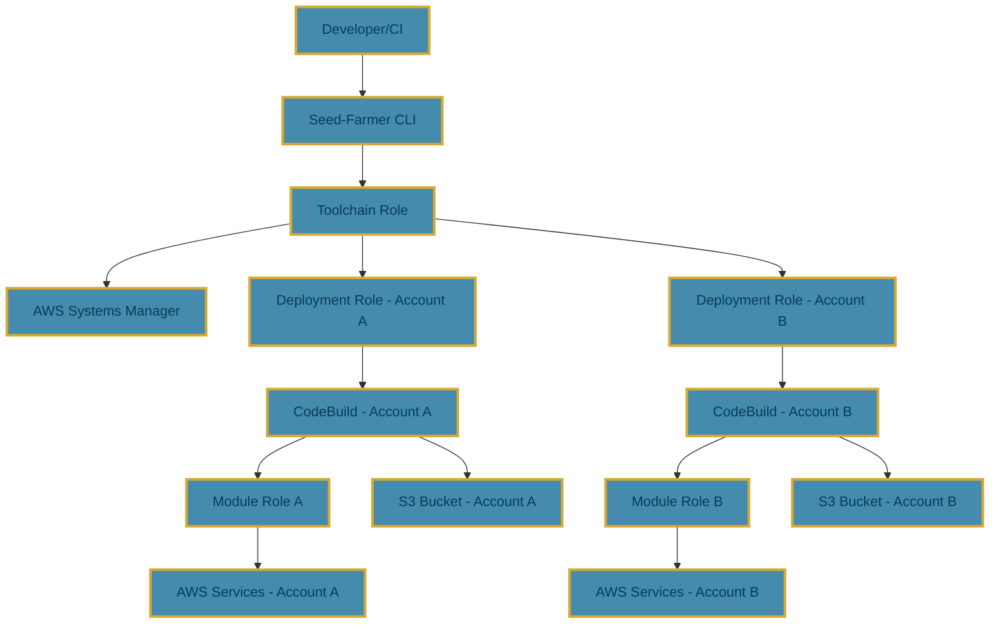
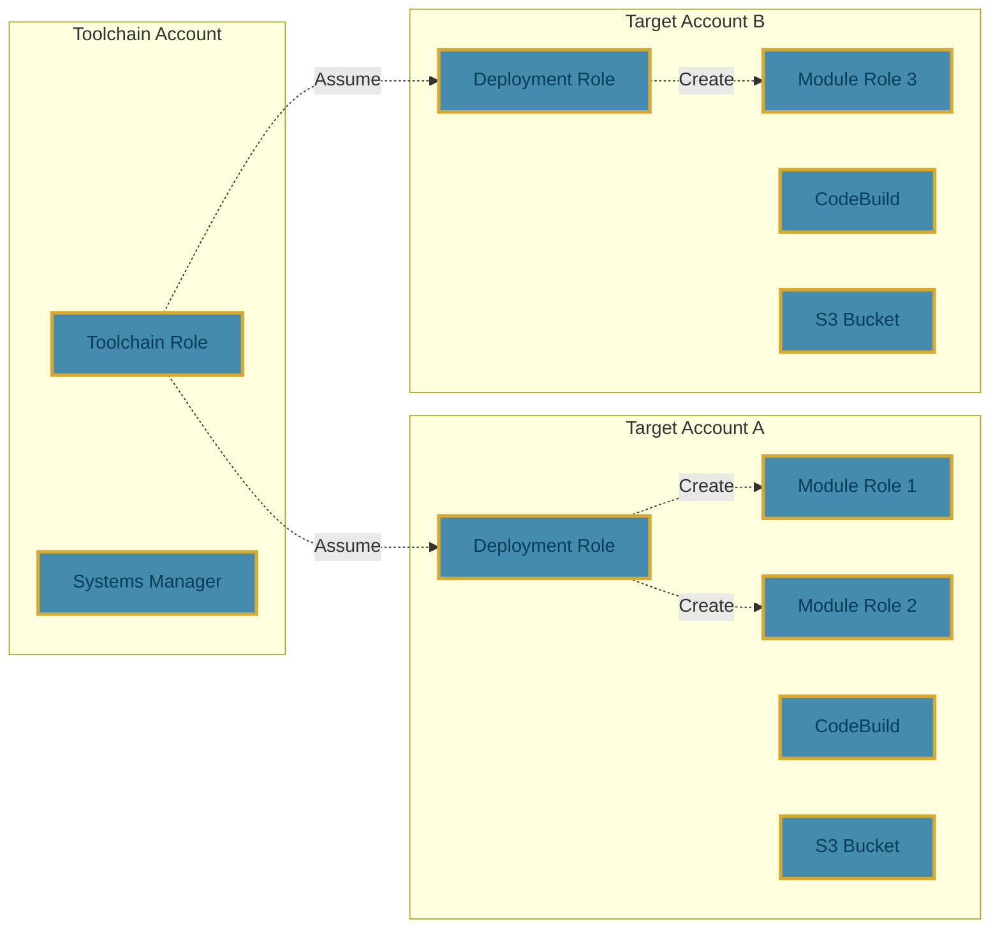
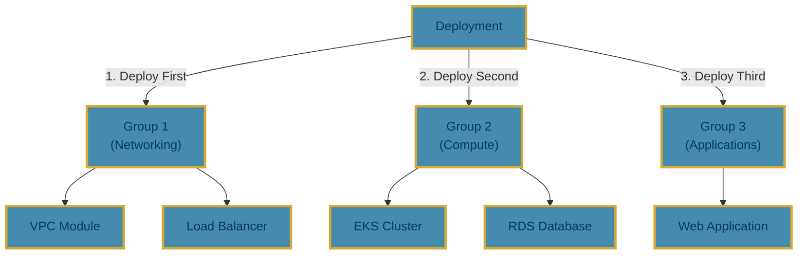
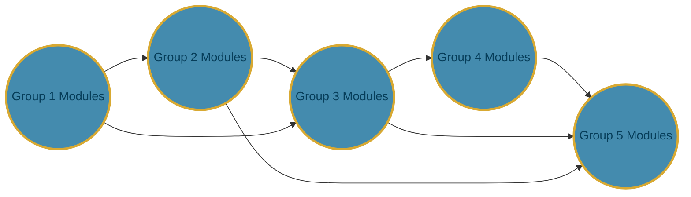

This page explains the overall architecture of Seed-Farmer, including its multi-account security model, deployment orchestration, and integration with AWS services.

## Overview

Seed-Farmer is designed as a **deployment orchestrator** that acts as a secure broker between your Infrastructure as Code (IaC) modules and AWS services. Rather than executing deployments directly, Seed-Farmer coordinates deployments through AWS CodeBuild, ensuring security, auditability, and scalability.

### Key Architectural Principles

- **Security First**: Least-privilege IAM roles with clear separation of concerns
- **Multi-Account Native**: Built from the ground up for multi-account AWS environments
- **GitOps Driven**: Declarative configuration with version control integration
- **Scalable Execution**: Parallel deployment across accounts, regions, and modules
- **Auditable Operations**: Complete deployment history and logging

## High-Level Architecture



## Security Model

Seed-Farmer implements a comprehensive **least-privilege security model** with multiple layers of access control:

### Role Hierarchy

#### 1. Toolchain Role

- **Location**: Toolchain account
- **Purpose**: Orchestrates deployments and manages metadata
- **Permissions**:
  - Read/write deployment metadata in AWS Systems Manager
  - Assume deployment roles in target accounts
  - Manage project-level resources
- **Trust Policy**: Trusted by specified principals (users, CI/CD systems)

#### 2. Deployment Role

- **Location**: Each target account
- **Purpose**: Manages deployments within a specific account
- **Permissions**:
  - Create and manage CodeBuild projects (seedkit)
  - Manage S3 buckets for deployment artifacts
  - Create and manage module-specific IAM roles
  - Read/write access to AWS Systems Manager for module metadata
  - Access to AWS Systems Manager Parameter Store for state management
- **Trust Policy**: Trusted by the toolchain role

#### 3. Module Role

- **Location**: Target account (per module)
- **Purpose**: Execute specific module deployments
- **Permissions**: Module-specific permissions defined in `modulestack.yaml`
- **Trust Policy**: Trusted by CodeBuild service

### Security Boundaries



## Multi-Account Architecture

Seed-Farmer is architected for **multi-account AWS environments** with clear separation between orchestration and execution. The system uses a **toolchain account** for central orchestration and **target accounts** for actual infrastructure deployment.


### Key Principles

- **Account Isolation**: Each target account operates independently with its own seedkit infrastructure
- **Centralized Orchestration**: Single toolchain account coordinates all deployments
- **Secure Role Assumption**: Cross-account access through least-privilege IAM roles
- **Scalable Execution**: Parallel deployments across multiple accounts and regions

For detailed information about multi-account configuration, role setup, security considerations, and best practices, see [Multi-Account Support](multi-account.md).

## Deployment Orchestration

### Execution Models

Seed-Farmer supports two execution models to accommodate different use cases:

#### Remote Deployments (Production)

- **Execution Environment**: AWS CodeBuild
- **Use Cases**: Production deployments, CI/CD pipelines
- **Benefits**:
  - Scalable and reliable
  - Complete audit trail
  - VPC and network isolation
  - No local dependencies

#### Local Deployments (Development)

- **Execution Environment**: Local Docker containers
- **Use Cases**: Development, testing, debugging
- **Benefits**:
  - Fast feedback loop
  - No AWS charges for compute
  - Real-time output
  - Offline development capability

### Parallel Execution

Seed-Farmer optimizes deployment performance through multiple levels of parallelism:



**Execution Flow:**

- **Sequential Groups**: Seed-Farmer calls groups one after another in dependency order (Group 1, then Group 2, then Group 3)
- **Parallel Modules**: Modules within each group deploy simultaneously
- **Account Isolation**: Each target account processes its modules independently

**Parallelism Levels:**

- **Account-Level**: Multiple target accounts deploy simultaneously
- **Group-Level**: Seed-Farmer calls groups sequentially in dependency order
- **Module-Level**: Modules within each group deploy concurrently (in parallel)
- **Configurable Concurrency**: Adjustable parallelism per group

### Dependency Management

The groups are deployed as a **Directed Acyclic Graph (DAG)** and the module dependency relationships are aligned to the groups of the DAG.

Here's a basic DAG structure showing a possible workflow pattern and module dependency relationships:



This allows Seed-Farmer to provide sophisticated dependency management:

- **Automatic Ordering**: Analyzes module dependencies and determines deployment order
- **Circular Detection**: Prevents invalid circular dependencies
- **Validation**: Blocks destruction of modules with active dependents
- **Force Redeploy**: Option to cascade changes through dependency chains

### Force Dependency Redeploy

When a module changes (is redeployed), downstream modules that are dependent on it may need to consume those changes. The `forceDependencyRedeploy` flag in the deployment manifest tells Seed-Farmer to force a redeploy of all modules impacted by the redeploy of another module.

!!! warning
    This is an indiscriminate feature that is not granular enough to detect what is causing a redeploy, only that one needs to occur. Any change to a module will trigger a redeploy of that module and all downstream modules that depend on it, even if the underlying logic or artifact has not changed.

## Seedkit Infrastructure

The **seedkit** is the foundational infrastructure that Seed-Farmer deploys in each target account and region to enable module deployments. It provides the necessary AWS resources for both local and remote deployments.

### What is the Seedkit?

The seedkit is a CloudFormation stack that contains the core infrastructure components required for Seed-Farmer operations:

- **AWS CodeBuild Project**: Executes module deployments and destructions
- **IAM Roles**: Service roles for CodeBuild execution
- **S3 Bucket**: Stores deployment bundles and artifacts
- **CloudWatch Log Groups**: Captures deployment execution logs
- **VPC Configuration**: Optional VPC settings for private deployments

### Seedkit Components

#### CodeBuild Project

- **Purpose**: Executes module deployspec commands in isolated environments
- **Configuration**: Automatically configured with appropriate compute resources and runtime
- **Networking**: Can be configured to run in VPC for private resource access
- **Logging**: All execution logged to CloudWatch for auditability

#### S3 Artifact Bucket

- **Purpose**: Stores module bundles, deployment artifacts, and build outputs
- **Naming**: `seedfarmer-<project>-<account>-<region>-<hash>`
- **Security**: Encrypted at rest, access controlled via IAM roles
- **Lifecycle**: Configurable retention policies for cost optimization

#### IAM Service Roles

- **CodeBuild Service Role**: Allows CodeBuild to access necessary AWS services
- **Module Deployment Roles**: Created per-module with least-privilege permissions
- **Cross-Account Trust**: Enables secure cross-account deployments

#### CloudWatch Logs

- **Log Groups**: `/aws/codebuild/<project-name>`
- **Retention**: Configurable (default: 30 days)
- **Access**: Controlled via IAM for security and compliance

### Seedkit Deployment

#### Automatic Deployment

Seed-Farmer automatically deploys the seedkit during the first deployment to each account/region:

1. **Detection**: Checks for existing seedkit stack in target account/region
2. **Deployment**: Creates seedkit if not found or updates if needed
3. **Configuration**: Applies project-specific settings and networking
4. **Validation**: Verifies all components are properly configured

#### Manual Management

You can also manage the seedkit manually using Seed-Farmer CLI commands:

```bash
# Deploy seedkit manually to specific account/region
seedfarmer seedkit deploy myproject --region us-east-1

# Deploy seedkit with VPC configuration
seedfarmer seedkit deploy myproject --region us-east-1 --vpc-id vpc-12345678 --subnet-id subnet-abcd1234 --sg-id sg-ijkl9012

# Update existing seedkit
seedfarmer apply --update-seedkit

# Destroy seedkit
seedfarmer seedkit destroy myproject --region us-east-1
```

!!! note "Seedkit Management"
    While the seedkit is automatically deployed during the first `seedfarmer apply` operation, you can also deploy, update, and destroy it manually using the `seedfarmer seedkit` commands.

### Seedkit Naming Convention

The seedkit follows a consistent naming pattern:

- **Stack Name**: `aws-codeseeder-<project-name>`
- **Resources**: Prefixed with `codeseeder-<project>` name for identification
- **S3 Bucket**: `codeseeder-<project>-<account>-<hash>`

Example for a project named "data-platform":

- Stack: `aws-codeseeder-data-platform`
- CodeBuild Project: `codeseeder-data-platform`
- S3 Bucket: `codeseeder-data-platform-123456789012-abc123`

### Seedkit Configuration

#### VPC Configuration

For modules requiring private network access:

```yaml
# In deployment manifest
targetAccountMappings:
  - alias: production
    accountId: 123456789012
    regionMappings:
      - region: us-east-1
        network:
          vpcId: vpc-12345678
          privateSubnetIds:
            - subnet-abcd1234
            - subnet-efgh5678
          securityGroupIds:
            - sg-ijkl9012
```

#### Permissions Boundaries

Apply permissions boundaries to seedkit roles:

```yaml
targetAccountMappings:
  - alias: production
    accountId: 123456789012
    parametersGlobal:
      permissionsBoundaryName: MyOrgBoundary
```

### Seedkit Lifecycle Management

#### Updates

The seedkit is not automatically updated.  A manual update is requested via `--update-seedkit` flag when using the `seedfarmer seedkit` CLI.  This is to prevent accidental updates when changing Seed-Farmer versions, or if making customizations to the seedkit artifacts (ex. the managed policy).

#### Deletion

The seedkit can be destroyed via the `seedfarmer destroy` CLI, but it is not discriminate (it does no checking of dependencies).

```bash
# Remove seedkit along with deployment
seedfarmer destroy my-deployment --remove-seedkit
```

!!! warning "Seedkit Deletion Impact"
    Deleting the seedkit removes:

    - All CodeBuild project history
    - Stored deployment bundles in S3
    - CloudWatch logs (subject to retention policy)
    
    Deployed modules remain unaffected, but you lose deployment history and the ability to destroy modules through Seed-Farmer.

## Seed-Farmer Artifacts

For each account / region, Seed-Farmer will also deploy an S3 Bucket to store the bundled code used for each successfully deployed module.  This bundle is the exact code used to deploy and is to support the deletion of the module.  Once the module is destroyed, the bundled code is deleted.

### What are Seed-Farmer Artifacts?

The Seed-Farmer artifacts are comprised of a Cloudformation stack that contains the definition of the S3 bucket and an S3 bucket policy.

### Seed-Farmer Artifacts Naming Convention

The artifacts follow a consistent naming pattern:

- **Stack Name**: `seedfarmer-<project-name>-artifacts`
- **S3 Bucket**: `seedfarmer-<project>-<region>-<account>-<hash>-no-delete`
- **S3 Bucket Policy**: `seedfarmer-<project>-<region>-<account>-<hash>-no-delete`

Example for a project named "data-platform":

- Stack: `seedfarmer-data-platform-artifacts`
- S3 Bucket: `seedfarmer-data-platform-us-east-1-123456789012-abc123-no-delete`
- S3 Bucket Policy: `seedfarmer-data-platform-us-east-1-123456789012-abc123-no-delete`

Seed-Farmer will deploy this stack in each account / region that is configured.
Seed-Farmer will delete this stack if determined that there are no more deployments using it.

## State Management

Seed-Farmer stores deployment state in AWS Systems Manager Parameter Store. This includes:

- Deployment metadata
- Module metadata
- Module outputs

This state management allows Seed-Farmer to track what has been deployed and detect changes that require redeployment.

## Conclusion

The Seed-Farmer architecture provides a secure, flexible, and scalable way to deploy infrastructure across multiple AWS accounts and regions. By leveraging AWS CodeBuild, it ensures that deployments are repeatable, auditable, and follow the principle of least privilege
