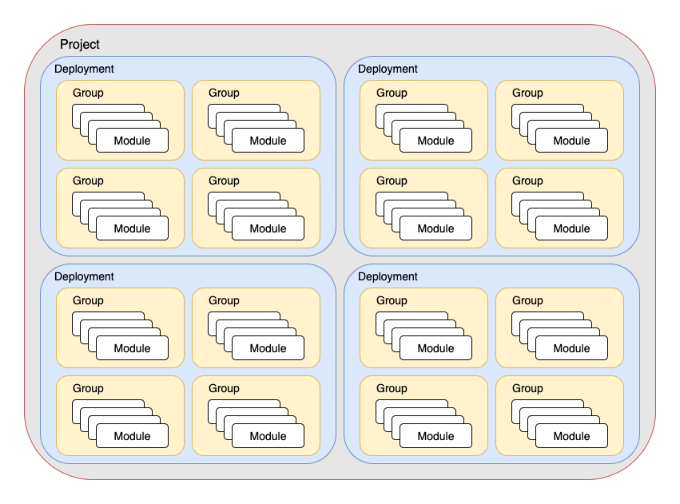

# Fundamentals Concepts 

This section explains the fundamental concepts behind Seed-Farmer, providing a deeper understanding of how the system works and its key architectural principles.

Seed-Farmer is a [GitOps-based](https://opengitops.dev/) framework for deploying Infrastructure as Code (IaC) modules across multiple AWS accounts and regions. It orchestrates deployments using AWS CodeBuild while maintaining security, scalability, and auditability.

## Architecture

The [Architecture](architecture.md) page explains the overall architecture of Seed-Farmer, including:

- Multi-account security model with IAM role assumption
- Seedkit infrastructure components
- Integration with AWS CodeBuild for remote deployments
- State management and metadata storage

## Multi-Account Support

Seed-Farmer is designed from the ground up for multi-account AWS environments. The [Multi-Account Support](multi-account.md) page explains:

- Toolchain and target account roles
- Cross-account IAM role assumption
- Permissions boundaries and security controls
- Account isolation and resource management

## Key Components

Understanding Seed-Farmer's hierarchical structure is essential for effective usage:

### Project

A **project** is the top-level organizational unit in Seed-Farmer:

- Provides complete isolation between different projects
- Contains all deployments, groups, and modules for a specific initiative
- Defined in the `seedfarmer.yaml` configuration file

### Deployment

A **deployment** represents a complete set of infrastructure for a specific environment:

- Contains all modules and their configurations for an environment (e.g., dev, staging, prod)
- Provides a logical isolation between different environments within the same project
- Manages state and metadata for all contained modules

### Group

A **group** represents modules that can be deployed concurrently:

- Contains modules with no interdependencies
- Enables parallel deployment for improved performance
- Maintains deployment order (groups deploy sequentially, modules within groups deploy in parallel)
- Reverses order during destruction (last deployed group is destroyed first)

### Module

A **module** is the fundamental deployable unit:

- Contains Infrastructure as Code
- Can be deployed multiple times with different configurations
- Exports metadata for consumption by dependent modules

## Deployment Orchestration

### Dependency Management

Seed-Farmer provides sophisticated dependency management:

- **Automatic ordering**: Ensures modules deploy in correct dependency order
- **Circular dependency detection**: Prevents invalid dependency configurations
- **Dependency validation**: Blocks destruction of modules with active dependents
- **Force redeploy**: Option to redeploy all dependent modules when dependencies change

### Execution Models

Seed-Farmer supports two execution models:

- **Remote Deployments**: Execute in AWS CodeBuild (default, production-ready)
- **Local Deployments**: Execute in local Docker containers (development-focused)

## Data Flow and Integration

### Parameter System

Seed-Farmer has a comprehensive configuration system (parameters) supporting:

- **Static values**: Direct parameter values in manifests
- **Environment variables**: Runtime values from environment
- **Module metadata**: Outputs from other deployed modules
- **AWS SSM Parameter Store**: Centralized parameter management
- **AWS Secrets Manager**: Secure handling of sensitive values
- **Global and regional parameters**: Shared values across modules

### Metadata Sharing

Modules share references of deployed artifacts via a metadata management system:

- **Export**: Modules export outputs as JSON metadata
- **Import**: Dependent modules reference metadata as parameters
- **Storage**: Metadata stored in [AWS SSM Parameter Store](https://docs.aws.amazon.com/systems-manager/latest/userguide/systems-manager-parameter-store.html),
- **Versioning**: Metadata tracked per deployment for consistency

### State Management

Seed-Farmer maintains deployment state through:

- **Deployment manifests**: Stored in AWS Systems Manager
- **Module metadata**: Individual module outputs and status
- **Checksums**: Module and manifest change detection
- **History**: Deployment and destruction audit trail

## Security Model

### Least-Privilege Access

Seed-Farmer implements a comprehensive security model:

- **Toolchain roles**: Limited to orchestration and metadata management
- **Deployment roles**: Account-specific with minimal required permissions
- **Module roles**: Module-specific permissions via `modulestack.yaml`
- **Permissions boundaries**: Optional additional security constraints

### Multi-Account Isolation

Security is enforced through account boundaries:

- **Account separation**: Target accounts isolated from each other
- **Role assumption**: Secure cross-account access patterns
- **Resource isolation**: No cross-account resource sharing by default
- **Audit trails**: Complete deployment history per account

## GitOps Principles

Seed-Farmer follows [GitOps](https://opengitops.dev/) best practices:

- **Declarative configuration**: Infrastructure defined in manifest files
- **Version control**: All configurations stored in Git repositories
- **Automated deployment**: Changes trigger deployment pipelines

## Scalability and Performance

### Parallel Execution

Seed-Farmer optimizes deployment performance by parallelizing grouped module deployment.  Each module deployment execution is independent: failure of one module within the group does not impact the other modules in that group...but after all modules within the group complete, Seed-Farmer halts deployment.

- **Module-level parallelism**: Modules within groups deploy concurrently
- **Account-level parallelism**: Multi-account deployments run in parallel
- **Configurable concurrency**: Adjustable parallelism per group

### Resource Efficiency

- **Change detection**: Only deploys modules with actual changes
- **Bundle optimization**: Efficient packaging of module code and data
- **Caching**: Reuses unchanged components where possible
- **Cleanup**: Automatic cleanup of temporary resources

## Best Practices

### Organization

- **Logical grouping**: Organize modules by function and dependencies
- **Environment separation**: Use separate deployments for different environments
- **Account strategy**: Align account structure with organizational boundaries
- **Naming conventions**: Use consistent, descriptive names throughout

### Development Workflow

- **Local testing**: Use local deployments for development and testing
- **Incremental changes**: Make small, testable changes
- **Dependency management**: Carefully design module dependencies
- **Documentation**: Maintain comprehensive module documentation

For detailed information about specific aspects, see the individual concept pages and reference documentation.
