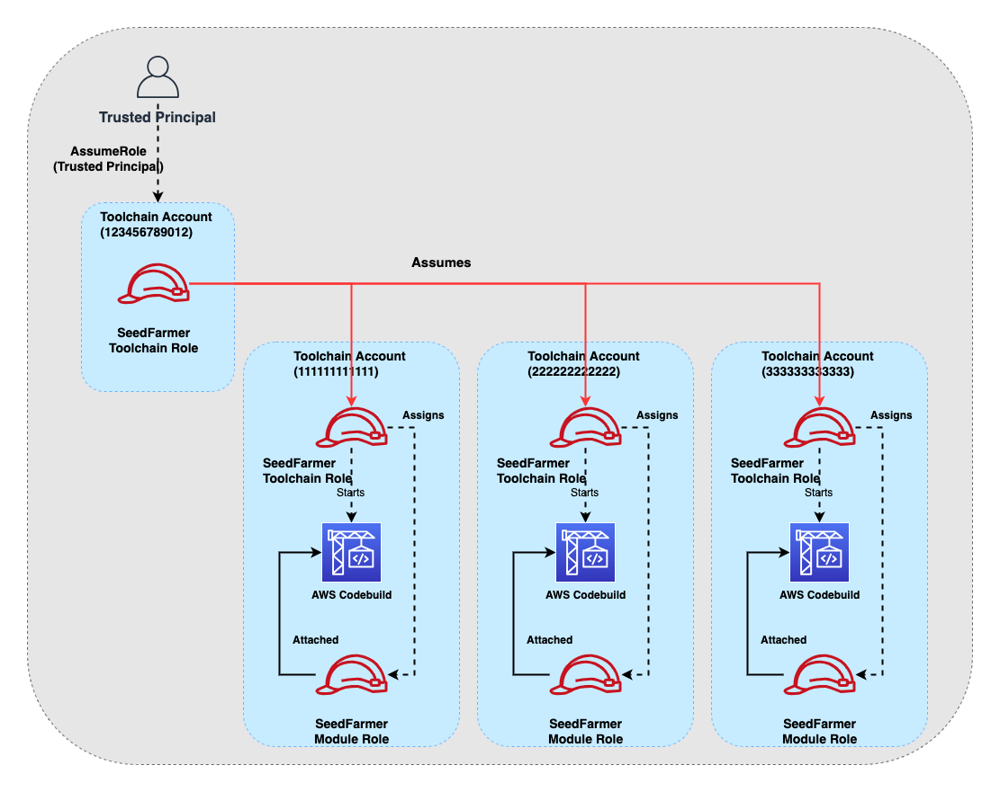

# Multi-Account Support in Seed-Farmer

Seed-Farmer is designed to work across multiple AWS accounts, allowing you to deploy resources in different accounts from a central toolchain account. This page explains how Seed-Farmer manages deployments across toolchain and target accounts.

## Account Types

Seed-Farmer uses two types of accounts:

- **Toolchain Account**: The primary account that stores deployment metadata and coordinates deployments
- **Target Account(s)**: The account(s) where modules are actually deployed

There can be only ONE toolchain account with many target accounts. A toolchain account can also be a target account. Each account only needs to be bootstrapped once, regardless of the region that modules are deployed in. The roles created are global to the account.

## IAM Roles

Seed-Farmer uses IAM roles to manage access between accounts:

- **Toolchain Role**: Created in the toolchain account and assumed by the user or CI/CD system
- **Deployment Role**: Created in each target account and assumed by the toolchain role
- **Module-Specific Roles**: Created for each module with only the permissions needed for that module

The toolchain role assumes the deployment role in the target account, which then assumes the module-specific role to deploy the module.



## Role Assumption Flow

The role assumption flow works as follows:

1. The user or CI/CD system assumes the toolchain role in the toolchain account
2. The toolchain role assumes the deployment role in the target account
3. The deployment role assumes the module-specific role to deploy the module

This role assumption chain ensures that each component has only the permissions it needs to perform its specific tasks.

## Account Mappings in Deployment Manifests

In the deployment manifest, you define target account mappings that specify which accounts to deploy to and their configurations:

```yaml
targetAccountMappings:
  - alias: primary
    accountId:
      valueFrom:
        envVariable: PRIMARY_ACCOUNT
    default: true
    parametersGlobal:
      dockerCredentialsSecret: nameofsecret
      permissionsBoundaryName: policyname
    regionMappings:
      - region: us-east-2
        default: true
        parametersRegional:
          vpcId: vpc-XXXXXXXXX
          privateSubnetIds:
            - subnet-XXXXXXXXX
            - subnet-XXXXXXXXX
  - alias: secondary
    accountId: 123456789012
    regionMappings:
      - region: us-west-2
        parametersRegional:
          dockerCredentialsSecret: nameofsecret
      - region: us-east-2
        default: true
```

Each account mapping includes:

- **alias**: A logical name for the account, referenced by module manifests
- **accountId**: The AWS account ID (can use environment variables)
- **default**: Whether this is the default account for modules that don't specify an account
- **parametersGlobal**: Parameters that apply to all regions in this account
- **regionMappings**: Region-specific configurations for this account

## Module Account Targeting

In the module manifest, you specify which account to deploy the module to using the `targetAccount` field:

```yaml
name: networking
path: modules/optionals/networking/
targetAccount: primary
parameters:
  - name: internet-accessible
    value: true
```

This will deploy the module to the account with the alias `primary` as defined in the deployment manifest.

## Cross-Account Parameter References

Modules can reference parameters from other modules, even if they are deployed in different accounts. This allows for complex cross-account deployments:

```yaml
name: buckets
path: modules/optionals/buckets
targetAccount: secondary
parameters:
  - name: vpc-id
    valueFrom:
      moduleMetadata:
        group: optionals
        name: networking
        key: VpcId
```

In this example, the `buckets` module in the `secondary` account references the `VpcId` output from the `networking` module in the `primary` account.

## Security Considerations

### IAM Path Prefixes

You can use IAM path prefixes for the toolchain role, target account deployment roles, and policies. This allows you to create logical separation to simplify permissions management:

```bash
seedfarmer bootstrap toolchain \
  --project myproject \
  --trusted-principal arn:aws:iam::123456789012:role/Admin \
  --role-prefix /myproject/ \
  --policy-prefix /myproject/
```

### Qualifiers for Roles

You can use qualifiers to segregate target deployments when using a multi-account structure. A qualifier appends a 6-character alpha-numeric string to the deployment role and toolchain role:

```bash
seedfarmer bootstrap toolchain \
  --project myproject \
  --trusted-principal arn:aws:iam::123456789012:role/Admin \
  --qualifier dev123
```

!!! important
    The qualifier **must be the same** on the toolchain role and each target role.

### Permissions Boundaries

You can apply permissions boundaries to the toolchain and deployment roles to further restrict their permissions:

```bash
seedfarmer bootstrap toolchain \
  --project myproject \
  --trusted-principal arn:aws:iam::123456789012:role/Admin \
  --permissions-boundary arn:aws:iam::123456789012:policy/MyBoundary
```

## Best Practices

When working with multiple accounts, consider the following best practices:

1. **Use a dedicated toolchain account**: Keep your toolchain account separate from your production accounts to minimize the risk of accidental changes.

2. **Apply least privilege**: Use module-specific roles with only the permissions needed for each module.

3. **Use permissions boundaries**: Apply permissions boundaries to the toolchain and deployment roles to further restrict their permissions.

4. **Document account relationships**: Keep track of which modules are deployed to which accounts and their dependencies.

5. **Use consistent naming**: Use consistent naming conventions for accounts, roles, and modules to make it easier to understand the relationships between them.

6. **Test in isolation**: Test changes in a development environment before applying them to production accounts.

7. **Monitor role assumptions**: Monitor role assumptions between accounts to detect unauthorized access.
