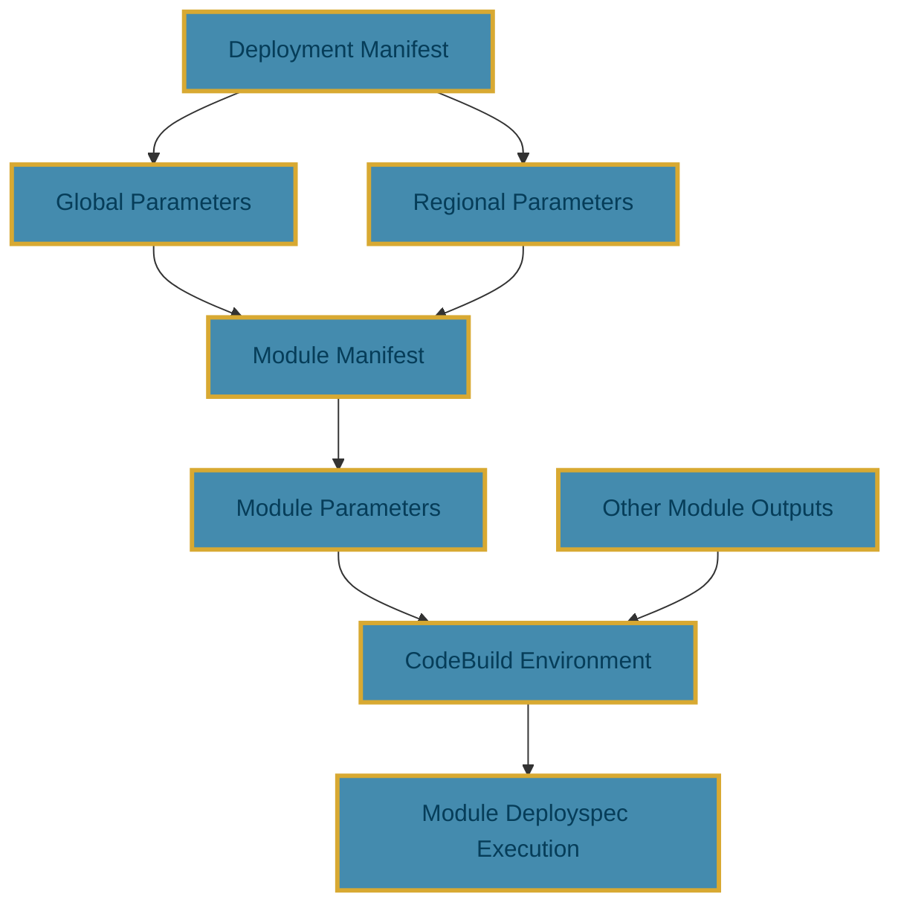

Manifests are the foundation of Seed-Farmer deployments. They define **what** gets deployed, **where** it gets deployed, and **how** it gets configured. This page explains the purpose and structure of these manifests.

## Overview

Seed-Farmer uses two types of manifests to orchestrate deployments:

- **Deployment Manifest**: The top-level configuration that defines the overall deployment strategy
- **Module Manifest**: Individual module configurations that define specific components to deploy

Think of the deployment manifest as the "blueprint" for your entire infrastructure deployment, while module manifests are the "building blocks" that make up that deployment.

## Deployment Manifest

### What It Does

The deployment manifest serves as the **master configuration** for your entire deployment. It answers these key questions:

- **Where should things be deployed?** (Target accounts and regions)
- **What groups of modules should be deployed together?** (Grouping and sequencing)
- **How should the deployment be coordinated?** (Toolchain configuration, concurrency limits)
- **What shared configuration applies across modules?** (Global parameters, network settings)

### Key Responsibilities

1. **Multi-Account Orchestration**: Defines which AWS accounts and regions to deploy to
2. **Deployment Sequencing**: Controls the order in which groups of modules are deployed
3. **Shared Parameters**: Provides common configuration values that multiple modules can reference
4. **Network Configuration**: Defines VPC settings for CodeBuild execution environments

### Structure and Example

```yaml
name: my-infrastructure-deployment
toolchainRegion: us-west-2
forceDependencyRedeploy: false

# Define groups of modules - deployed sequentially
groups:
  - name: networking
    path: manifests/networking-modules.yaml
  - name: compute
    path: manifests/compute-modules.yaml
    concurrency: 4  # Optional: limit parallel execution
  - name: applications
    path: manifests/app-modules.yaml

# Define target accounts and their configurations
targetAccountMappings:
  - alias: production
    accountId:
      valueFrom:
        envVariable: PROD_ACCOUNT_ID
    default: true
    parametersGlobal:
      permissionsBoundaryName: MyOrgBoundary
    regionMappings:
      - region: us-east-1
        default: true
        parametersRegional:
          vpcId: vpc-12345678
          privateSubnetIds:
            - subnet-abcd1234
            - subnet-efgh5678
```

### Critical Fields Explained

#### Groups

Groups define **deployment phases**. Modules within a group deploy in parallel, but groups deploy sequentially:

```yaml
groups:
  - name: foundation      # Deploys first (VPCs, IAM roles)
    path: manifests/foundation.yaml
  - name: data-layer      # Deploys second (databases, storage)
    path: manifests/data.yaml  
  - name: applications    # Deploys last (apps that depend on data layer)
    path: manifests/apps.yaml
```

#### Target Account Mappings

This section defines **where** your modules will be deployed:

```yaml
targetAccountMappings:
  - alias: dev           # Logical name used in module manifests
    accountId: 111111111111
    regionMappings:
      - region: us-east-1
        parametersRegional:
          environment: development
  - alias: prod
    accountId: 222222222222  
    regionMappings:
      - region: us-east-1
      - region: us-west-2    # Multi-region deployment
```

## Module Manifest

### What It Does

Module manifests define **individual deployable components**. Each module manifest answers:

- **What specific infrastructure should be created?** (The module's purpose)
- **Where should this module be deployed?** (Target account/region)
- **What configuration does this module need?** (Parameters and dependencies)
- **How should this module access other resources?** (Dependencies on other modules)

### Key Responsibilities

1. **Component Definition**: Specifies what infrastructure component to deploy
2. **Location Targeting**: Defines which account and region to deploy to
3. **Parameter Configuration**: Provides module-specific configuration values
4. **Dependency Management**: References outputs from other modules
5. **Source Management**: Defines where the module code is located (local, Git, archive)

### Structure and Example

```yaml
# Module in networking group - creates VPC foundation
name: vpc-network
path: modules/networking/vpc/
targetAccount: production
targetRegion: us-east-1
parameters:
  - name: cidr-block
    value: "10.0.0.0/16"
  - name: enable-dns-hostnames
    value: true
---
# Another module in the same networking group - creates subnets
# Note: Modules in the same group deploy in parallel and cannot reference each other
name: security-groups
path: modules/networking/security/
targetAccount: production
targetRegion: us-east-1
parameters:
  - name: vpc-cidr
    value: "10.0.0.0/16"
  - name: allow-ssh
    value: true
```

### Critical Fields Explained

#### Path

The path element tells Seed-Farmer where to fetch the module code in order to package it for deployment. Currently modules can be sourced from:

- Local Filesystem
- Git Repositories
- Archives (zip and tar via HTTPS)

These are all valid paths:

```yaml
path: module/module-name

path: git::https://github.com/awslabs/idf-modules.git//modules/dummy/blank?ref=release/1.2.0

path: git::https://github.com/awslabs/idf-modules.git//modules/dummy/blank/?ref=2d0aee3880bbf195129c441529f91ad074983037

path: archive::https://myhostedurl.com/allmymodules.zip?module=modules/network/codebuild-security-group

```

!!! info "Module Sourcing"
    Please see [Module Sourcing](conventions.md/#module-sourcing) for details

#### Module Dependencies

Modules can reference outputs from other modules using `moduleMetadata`:

```yaml
parameters:
  - name: database-endpoint
    valueFrom:
      moduleMetadata:
        group: data-layer        # Group containing the database module
        name: postgres-db        # Name of the database module
        key: DatabaseEndpoint    # Specific output from that module
```

#### Parameter Sources

Modules can get configuration from multiple sources:

```yaml
parameters:
  # Static value
  - name: instance-type
    value: t3.large
    
  # From environment variable
  - name: key-pair-name
    valueFrom:
      envVariable: EC2_KEY_PAIR
      
  # From AWS SSM Parameter Store
  - name: ami-id
    valueFrom:
      parameterStore: /aws/service/ami-amazon-linux-latest/amzn2-ami-hvm-x86_64-gp2
      
  # From AWS Secrets Manager
  - name: database-password
    valueFrom:
      secretsManager: prod/database/password
```

## How Manifests Work Together

### Deployment Flow

1. **Deployment Manifest Processing**: Seed-Farmer reads the deployment manifest to understand the overall deployment strategy
2. **Account Setup**: Sets up toolchain and deployment roles in target accounts
3. **Group Processing**: Processes each group sequentially
4. **Module Processing**: Within each group, processes module manifests in parallel
5. **Parameter Resolution**: Resolves all parameter sources (environment variables, SSM, module dependencies)
6. **Module Deployment**: Executes each module's deployspec in AWS CodeBuild

### Parameter Flow Example



## Parameters and Environment Variables

### Parameter Processing

When Seed-Farmer processes parameters, it converts them into environment variables that are available in the CodeBuild environment where your module's deployspec runs.

### Environment Variable Naming Convention

**This is critically important**: Seed-Farmer transforms parameter names into environment variables using a specific naming convention.

#### Generic Modules (Default)

Parameters use the `SEEDFARMER_PARAMETER_` prefix:

```yaml
# In your module manifest
parameters:
  - name: vpc-id
    value: vpc-12345678
  - name: instanceType  
    value: t3.medium
  - name: some_database_name
    value: myapp-db
```

These become:

```bash
SEEDFARMER_PARAMETER_VPC_ID=vpc-12345678
SEEDFARMER_PARAMETER_INSTANCE_TYPE=t3.medium
SEEDFARMER_PARAMETER_SOME_DATABASE_NAME=myapp-db
```

#### Project-Specific Modules

Project-specific modules are a legacy feature that is now **strongly discouraged**. It is recommended to always create generic modules to avoid dependency on project naming. This feature is maintained for backward compatibility only.

When `publishGenericEnvVariables: false` is set in the deployspec, parameters are prefixed with your project name using `<PROJECT_NAME>_PARAMETER_<PARAMETER_KEY>` format:

```bash
MYAPP_PARAMETER_VPC_ID=vpc-12345678
MYAPP_PARAMETER_INSTANCE_TYPE=t3.medium
MYAPP_PARAMETER_SOME_DATABASE_NAME=myapp-db
```

!!! warning "Setting publishGenericEnvVariables to false"
    Changing publishGenericEnvVariables to false will make your module brittle as it can ONLY be used with projects that have the same name.
    This is defaulted to true but is available only for backward compatibility. Do not set this to false.

#### Naming Transformation Rules

Parameter names are transformed using these rules:

| Original Parameter Name | Environment Variable (Generic) |
|------------------------|--------------------------------|
| `vpc-id`               | `SEEDFARMER_PARAMETER_VPC_ID`  |
| `vpcId`                | `SEEDFARMER_PARAMETER_VPC_ID`  |
| `VpcId`                | `SEEDFARMER_PARAMETER_VPC_ID`  |
| `vpc_id`               | `SEEDFARMER_PARAMETER_VPC_ID`  |
| `instanceType`         | `SEEDFARMER_PARAMETER_INSTANCE_TYPE` |
| `some-complex-name`    | `SEEDFARMER_PARAMETER_SOME_COMPLEX_NAME` |

### Using Parameters in Your Deployspec

In your module's `deployspec.yaml`, you can reference these environment variables:

```yaml
# deployspec.yaml
deploy:
  phases:
    build:
      commands:
        # Reference the VPC ID parameter
        - echo "Deploying to VPC: $SEEDFARMER_PARAMETER_VPC_ID"
        # Use in CDK deployment
        - cdk deploy --parameters VpcId=$SEEDFARMER_PARAMETER_VPC_ID
        # Use in CloudFormation
        - aws cloudformation deploy --parameter-overrides VpcId=$SEEDFARMER_PARAMETER_VPC_ID
```

### System Environment Variables

Seed-Farmer also provides system-level environment variables:

#### Generic Modules (Default)

```bash
SEEDFARMER_PROJECT_NAME=myapp
SEEDFARMER_DEPLOYMENT_NAME=production  
SEEDFARMER_MODULE_NAME=vpc-network
SEEDFARMER_GROUP_NAME=networking
```

## Parameter Referencing in Manifests

The module manifests allow for custom configuration via the parameters.  Parameters can be referenced in any of the following defined manners.

### User Defined

These are simple key/value pairs passed in as strings.

```yaml
name: metadata-storage
path: modules/core/metadata-storage/
parameters:
  - name: glue-db-suffix
    value: db
  - name: data-table-suffix
    value: Data-Metadata
  - name: data-modified-table-suffix
    value: Modified-Metadata
```

### Environment

Seed-Farmer supports using [Dotenv](https://github.com/theskumar/python-dotenv) for dynamic replacement. When a file named `.env` is placed at the project root (where seedfarmer.yaml resides), any value in a manifest with a key of envVariable will be matched and replaced with the corresponding environment variable. You can pass in overriding .env files by using the `--env-file` on CLI command invocation.

Seed-Farmer supports passing multiple `.env`, by using `--env-file` where subsequent files will override duplicate values.

```yaml
name: opensearch
path: modules/core/opensearch/
parameters:
  - name: vpc-id
    valueFrom:
      envVariable: ENV_VPC_ID
```

!!! info "Global Replacement in Manifests"
    Seed-Farmer does support global dynamic replacement of values in the manifests. Please see [Global Overrides](conventions.md/#global-replace-in-manifests)

### Module Metadata

Metadata output from one module can be pass to another module as input by referencing the module metadata.  In the below example the `networking` module of the `optionals` group as an output named `key` that can used as input to the `opensearch` module.

```yaml
name: opensearch
path: modules/core/opensearch/
parameters:
  - name: vpc-id
    valueFrom:
      moduleMetadata:
        group: optionals
        name: networking
        key: VpcId
```

### AWS SSM Parameter

When leveraging an SSM Parameter, Seed-Farmer can populate an AWS CodeBuild environment parameter as a `PARAMETER_STORE` type for reference in your module.
AWS Codebuild manages fetching the value.

```yaml
name: opensearch
path: modules/core/opensearch/
parameters:
  - name: vpc-id
    valueFrom:
      parameterStore: my-vpc-id
```

!!! warning "Limited to Remote Deploy"
      This can only be used with Remote Deployments, not Local Deployments

### AWS Secrets Manager

When leveraging an AWS Secret, Seed-Farmer can populate an AWS CodeBuild environment parameter as a `SECRETS_MANAGER` type for reference in your module.
This is the recommended means to pass secured info to your module as AWS Codebuild brokers the retrieval.  No information is exposed in clear-text.

```yaml
name: opensearch
path: modules/core/opensearch/
parameters:
  - name: vpc-id
    valueFrom:
      secretsManager: my-secret-vpc-id
```

!!! warning "Limited to Remote Deploy"
      This can only be used with Remote Deployments, not Local Deployments

## Working with Data Files

Modules can include additional data files beyond their core infrastructure code using the `dataFiles` field in module manifests. This is useful for configuration files, scripts, certificates, or other assets needed during deployment.

### Data Files Configuration

```yaml
name: application-module
path: modules/applications/webapp/
targetAccount: primary
dataFiles:
  - filePath: data/config/app-config.json
  - filePath: data/scripts/setup.sh
  - filePath: data/certificates/ca-cert.pem
  - filePath: templates/deployment.yaml
parameters:
  - name: config-file
    value: app-config.json
```

### Data Files Structure

Data files are specified relative to your project root and are bundled with the module code during deployment:

```bash
project-root/
├── modules/
│   └── applications/
│       └── webapp/
│           ├── deployspec.yaml
│           └── app.py
├── data/
│   ├── config/
│   │   └── app-config.json
│   ├── scripts/
│   │   └── setup.sh
│   └── certificates/
│       └── ca-cert.pem
└── templates/
    └── deployment.yaml
```

### Accessing Data Files in Deployspec

Data files are available in the module's working directory during deployment:

```yaml
# deployspec.yaml
deploy:
  phases:
    build:
      commands:
        # Data files are available in the current directory
        - ls -la  # Shows bundled data files
        - cp app-config.json /tmp/config.json
        - chmod +x setup.sh && ./setup.sh
        - kubectl apply -f deployment.yaml
```

### Data Files Best Practices

1. **Use relative paths**: Always specify data file paths relative to the project root
2. **Organize logically**: Group related data files in appropriate directories (config/, scripts/, templates/)
3. **Keep files small**: Large data files can slow down module bundling and deployment
4. **Secure sensitive data**: Consider using AWS Secrets Manager or SSM Parameter Store for sensitive information instead of data files
5. **Document data file requirements**: Clearly document what data files are required and their expected format in your module's README

### Data Files Persistence Warning

!!! warning "Data Files Persistence Requirements"
    If you deploy with data files sourced from a local filesystem, you **MUST** provide those same files for future module updates. Seed-Farmer persists bundled code with data files for destroy operations only. Missing data files during updates will cause deployment failures.

### Common Use Cases

- **Configuration files**: Application configuration, environment-specific settings
- **Scripts**: Setup scripts, initialization scripts, custom deployment logic
- **Templates**: Kubernetes manifests, CloudFormation templates, configuration templates
- **Certificates**: SSL certificates, CA certificates (though AWS Certificate Manager is preferred)
- **Static assets**: Small static files needed by the deployed infrastructure

## Advanced Configuration

### Network Configuration for CodeBuild

You can configure CodeBuild to run in a VPC for modules that need access to private resources:

```yaml
# In deployment manifest
regionMappings:
  - region: us-east-1
    network:
      vpcId: vpc-12345678
      privateSubnetIds:
        - subnet-abcd1234
        - subnet-efgh5678
      securityGroupIds:
        - sg-ijkl9012
```

### Dependency Management

Seed-Farmer automatically manages dependencies between modules:

- **Prevents circular dependencies**: Validates that modules don't depend on each other in a loop
- **Enforces deployment order**: Ensures dependencies are deployed before dependent modules
- **Prevents premature deletion**: Blocks deletion of modules that other modules depend on

### Force Dependency Redeploy

Use the `forceDependencyRedeploy` flag to automatically redeploy dependent modules when their dependencies change:

```yaml
# In deployment manifest
forceDependencyRedeploy: true
```

!!! warning "Use with Caution"
    This flag causes ALL dependent modules to redeploy when ANY dependency changes, even if the change doesn't affect them. This can lead to unnecessary re-deployments and potential service disruptions.

## Best Practices

### Deployment Manifest Best Practices

1. **Use meaningful group names** that reflect deployment phases (foundation, data, applications)
2. **Only set concurrency limits when necessary** - modules in a group run in parallel by default; use concurrency only to restrict parallelism when you have resource constraints or need to limit simultaneous deployments
3. **Use environment variables** for account IDs and sensitive values
4. **Define global parameters** for values used across multiple modules
5. **Configure permissions boundaries** for enhanced security

### Module Manifest Best Practices

1. **Use descriptive module names** that clearly indicate the module's purpose
2. **Leverage module dependencies** instead of hardcoding resource references
3. **Use parameter sources appropriately**:
      - Static values for configuration that rarely changes
      - Environment variables for deployment-specific values
      - SSM parameters for shared configuration
      - Secrets Manager for sensitive data
      - Module metadata for resource dependencies
4. **Document parameter requirements** in your module's README
5. **Use consistent naming conventions** for parameters across related modules

### Parameter Best Practices

1. **Use kebab-case for parameter names** (e.g., `vpc-id`, `instance-type`)
2. **Choose descriptive parameter names** that clearly indicate their purpose
3. **Group related parameters** logically in your module manifests
4. **Validate parameter values** in your deployspec when possible
5. **Document parameter formats** and expected values in module documentation

## Common Patterns

### Multi-Environment Deployment

```yaml
# deployment-dev.yaml
name: myapp-development
targetAccountMappings:
  - alias: dev
    accountId:
      valueFrom:
        envVariable: DEV_ACCOUNT_ID

# deployment-prod.yaml  
name: myapp-production
targetAccountMappings:
  - alias: prod
    accountId:
      valueFrom:
        envVariable: PROD_ACCOUNT_ID
```

### Cross-Region Deployment

```yaml
targetAccountMappings:
  - alias: primary
    accountId: 123456789012
    regionMappings:
      - region: us-east-1
        default: true
      - region: us-west-2
```

## Full Definition - Deployment Manifest

This definition of a deployment manifest is relatively extensive compared to the module manifests.  The following represents a look-up of the currently available definitions.

```yaml
name: examples
nameGenerator:  ## Cannot be used with name ... one or the other
  prefix: myprefix
  suffix: 
    valueFrom:
        envVariable: SUFFIX_ENV_VARIABLE
toolchainRegion: us-west-2
forceDependencyRedeploy: False  ## Force ALL dependent modules to redeploy if an upstream module changes
archiveSecret: example-archive-credentials-modules ## SecretsManager that contains the credentials to access a private HTTPS archive for the modules
groups:
  - name: optionals
    path: manifests-multi/examples/optional-modules.yaml
    concurrency: 2 ## Limits the concurrency of module deployments, default matches the number of modules in group
  - name: optionals-2
    path: manifests-multi/examples/optional-modules-2.yaml
targetAccountMappings:
  - alias: primary ## The reference name modules use to dictate where they are deployed
    accountId: ${PRIMARY_ACCOUNT}  ## The syntax here support a global replace based on env parameters
    default: true
    codebuildImage:  public.ecr.aws/codebuild/amazonlinux2-x86_64-standard:5.0 ## The codebuild image override for all module in this account
    runtimeOverrides:
      python: "3.13"
    npmMirror: https://registry.npmjs.org/  ## Override the default npm mirror of this account
    npmMirrorSecret: /something/aws-myproject-mirror-credentials ## credentials in SecretsManager to use if necessary
    pypiMirror: https://pypi.python.org/simple ## Override the default pypi mirror of this account 
    pypiMirrorSecret: /something/aws-myproject-mirror-mirror-credentials  ## credentials in SecretsManager to use if necessary
    rolePrefix: /
    policyPrefix: / 
    parametersGlobal:
      dockerCredentialsSecret: nameofsecret
      permissionsBoundaryName: policyname
    regionMappings:
      - region: us-east-2
        default: true
        codebuildImage:  public.ecr.aws/codebuild/amazonlinux2-x86_64-standard:5.0 ## The codebuild image override for all module in this region (takes precedence over the account override)
        runtimeOverrides:
          python: "3.13"
        npmMirror: https://registry.npmjs.org/ ## (takes precedence over the account override)
        npmMirrorSecret: /something/aws-myproject-mirror-credentials ## (takes precedence over the account override)
        pypiMirror: https://pypi.python.org/simple ## (takes precedence over the account override)
        pypiMirrorSecret: /something/aws-myproject-mirror-credentials ## (takes precedence over the account override)
        parametersRegional:  ## Strictly lookup values for the rest of the manifests
          dockerCredentialsSecret: nameofsecret ## SecretsManager for docker login (to prevent throttling)
          permissionsBoundaryName: policyname
          vpcId: vpc-XXXXXXXXX 
          publicSubnetIds:
            - subnet-XXXXXXXXX
            - subnet-XXXXXXXXX
          privateSubnetIds:
            - subnet-XXXXXXXXX
            - subnet-XXXXXXXXX
          isolatedSubnetIds:
            - subnet-XXXXXXXXX
            - subnet-XXXXXXXXX
          securityGroupsId:
            - sg-XXXXXXXXX
        network:  ## Configure the seedkit / codebuild to use a VPC
            vpcId:  ## REQUIRED if configuring to use a vpc for codebuild
                valueFrom:
                parameterValue: vpcId ## The lookup in regionParameters or globalParameters
            privateSubnetIds: ## REQUIRED if configuring to use a vpc for codebuild
                valueFrom:
                parameterValue: privateSubnetIds
            securityGroupIds: ## REQUIRED if configuring to use a vpc for codebuild
                valueFrom:
                parameterValue: securityGroupIds
  - alias: secondary
    accountId: 123456789012
    regionMappings:
      - region: us-west-2
        parametersRegional:
          dockerCredentialsSecret: nameofsecret
          permissionsBoundaryName: policyname
      - region: us-east-2
        default: true

```

!!! info "Deployment Manifest Fields"
    NOTE: Not all fields are required and not all fields can be used simultaneously!  

## Full Definition - Module Manifest

```yaml
name: networking
path: git::https://github.com/awslabs/idf-modules.git/modules/optionals/networking/?ref=release/1.4.0 ## Pull from Git Repo
targetAccount: primary
parameters:
  - name: internet-accessible
    value: true
---  ## Multiple modules of a single group defined in one file
name: buckets
path: modules/optionals/buckets. ## Local path for module
targetAccount: secondary
targetRegion: us-west-2
codebuildImage:  public.ecr.aws/codebuild/amazonlinux2-x86_64-standard:5.0 ## The codebuild image override for this module (take precedence over all)
runtimeOverrides:
  python: "3.13"
npmMirror: https://registry.npmjs.org/
npmMirrorSecret: /something/aws-myproject-mirror-credentials
pypiMirror: https://pypi.python.org/simple
pypiMirrorSecret: /something/aws-myproject-mirror-credentials
parameters:
  - name: encryption-type
    value: SSE
  - name: some-name
    valueFrom:
      moduleMetadata:
        group: optionals
        name: networking
        key: VpcId
dataFiles:
  - filePath: data/test2.txt
  - filePath: test1.txt
  - filePath: git::https://github.com/awslabs/idf-modules.git//modules/storage/buckets/deployspec.yaml?ref=release/1.0.0&depth=1
  - filePath: archive::https://github.com/awslabs/idf-modules/archive/refs/tags/v1.6.0.tar.gz?module=modules/storage/buckets/deployspec.yaml ## Can pull a tar ot zip archive over HTTPS

```
