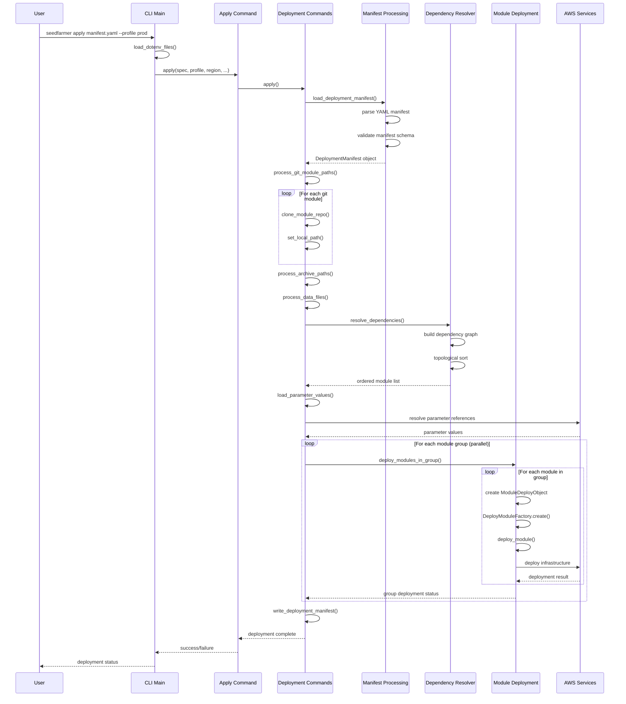

# Apply Deployment Workflow

This sequence diagram shows the end-to-end process when running `seedfarmer apply manifest.yaml`.

## Key Phases

1. **Initialization**: Load environment, parse CLI arguments
2. **Manifest Processing**: Parse and validate deployment manifest
3. **Source Preparation**: Clone git repos, fetch archives, process data files
4. **Dependency Resolution**: Build and sort dependency graph
5. **Parameter Resolution**: Resolve all parameter references
6. **Module Deployment**: Deploy modules in dependency order
7. **Completion**: Write final manifest and report status
