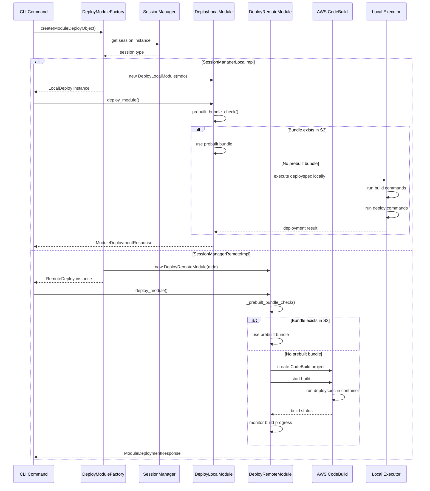

# Module Deployment Strategies

This sequence diagram shows how Seed-Farmer determines and executes module deployment strategies (Local vs Remote).

## Key Decision Points

1. **Session Type Detection**: The factory checks the SessionManager type to determine deployment strategy
    - Local deployments only support a single account / region and SeedFarmer manages this without the need to change manifests
2. **Bundle Optimization**: Only remote deployments check for prebuilt bundles in S3 to support destroy processing
3. **Execution Environment**:
    - Local: Runs deployspec commands directly on the local machine
    - Remote: Creates and executes CodeBuild projects in AWS

## Strategy Selection

- **Local Strategy**: Used when `--local` flag is set or when using local AWS credentials
- **Remote Strategy**: Default strategy using SeedFarmer toolchain roles and CodeBuild for isolation
