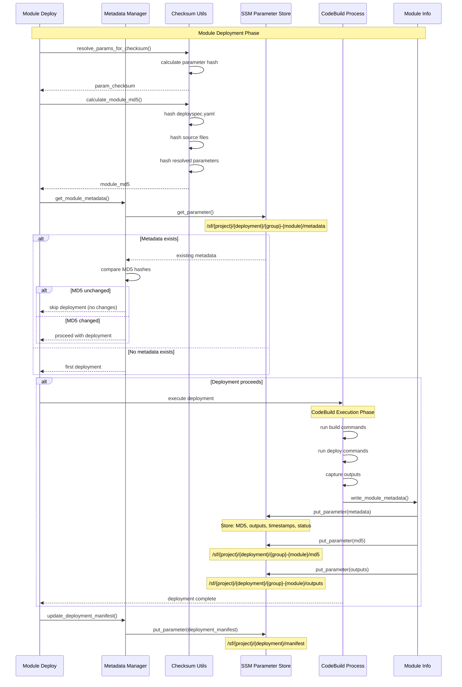

This sequence diagram shows how Seed-Farmer tracks module metadata and MD5 checksums in SSM Parameter Store.



## SSM Parameter Structure

### Deployment Manifest

```bash
Parameter: /{project}/{deployment}/manifest
Value: <complete deployment manifest JSON>
```

Successful deployment

```bash
Parameter: /{project}/{deployment}/manifest/deployed
Value: <complete deployment manifest JSON>
```

### Module Manifest

```bash
Parameter: /{project}/{deployment}/{group}/{module}/manifest
Value: <complete module manifest JSON>
```

### Module Metadata

```bash
Parameter: /{project}/{deployment}/{group}/{module}/metadata
Value: {
  "VpcId": "vpc-12345",
  "SubnetIds": ["subnet-123", "subnet-456"],
  "SecurityGroupId": "sg-789"
}
```

### Module MD5 Hash

```bash
Parameter: /{project}/{deployment}/{group}/{module}/md5/deployspec
Parameter: /{project}/{deployment}/{group}/{module}/md5/manifest
Parameter: /{project}/{deployment}/{group}/{module}/md5/bundle


Value: "abc123def456ghi789..."
```

### Deployspec

```bash
Parameter: /{project}/{deployment}/{group}/{module}/deployspec
Value: <complete module manifest YAML>
```

## MD5 Calculation Components

1. **Manifest Hash**: Resolved parameter values
2. **Bundle Hash**: Bundled module code (if remote deployment)
3. **Deployspec Hash**: Content of deployspec.yaml
