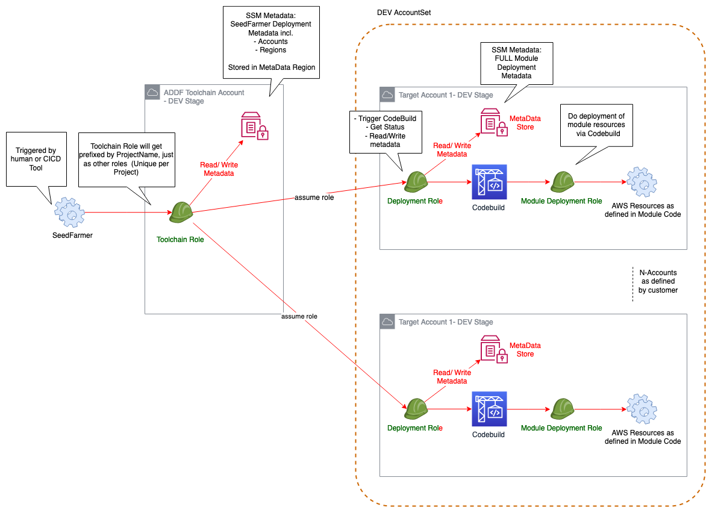
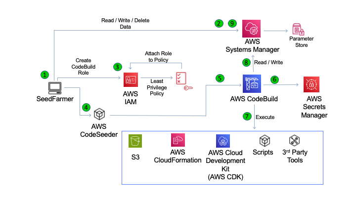

# Architecture

**Seed-Farmer** does not create its own deployments, rather it helps to deploy YOUR modules by acting as the broker between your 
module code and the AWS Cloud via AWS CodeSeeder.

## Multi-Account Architecture
`seedfarmer` leverages IAM roles and assumes the proper role for deployment of modules.  Please see these [account definitons](multiaccount_support) for details related to the role conventions.

1. Invoke **seedfarmer** CLI with role that can assume `toolchain role`
2. **seedfarmer** via `toolchain role` reads/writes deployment metadata with AWS Systems Manager
3. **seedfarmer** `toolchain role` assumes `deployment role` in all `target acccount` to fetch module metadata
4. **seedfarmer** via `deployment role` in `target acccount` initiates module deployment ([see below](method_processing))
5. **seedfarmer** via `deployment role` assumes `module deployment role` to complete module deployment

(method_processing)=
## Method of Processing
Below is a flow of `seedfarmer` deployment of a single module in a single account/region.  Once `seedfarmer` resolves the proper target/deployment role, the following depicts the steps taken to deploy a module.

1. Invoke **seedfarmer** CLI
2. **seedfarmer** reads/writes deployment metadata with AWS Systems Manager
3. **seedfarmer** invokes AWS IAM to create module-specific roles, attaching the proper least-privilege policies
4. **seedfarmer** leverages **AWS CodeSeeder** for remote deployment on AWS CodeBuild
5. **AWS CodeSeeder** prepares AWS CodeBuild 
6. AWS CodeBuild via **AWS CodeSeeder** inspects and fetches data from AWS SecretsManager (if necessary)
7. AWS CodeBuild via **AWS CodeSeeder** executes the custom **deployspec** for the module
8. AWS CodeBuild via **AWS CodeSeeder** updates AWS Systems Manager with completed module metadata
9. **seedfarmer** updates deployment metadata in AWS Systems Manager

