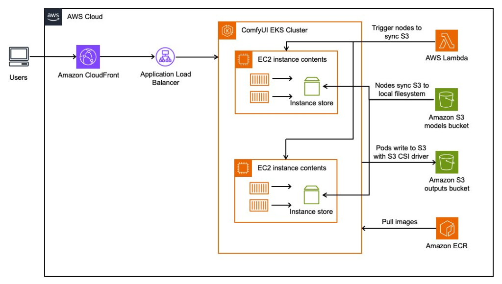

## Example Capability 

## This is an example...please edit me

### Overview
The AI-Powered does amazing things.  Let me tell you about it.

This solution addresses the following challenges: something, something.

### Business Value
- **Problem Statement**: here is my problem statement
- **Target Users**: Who will use this capability
- **Key Benefits**:
  - First Benefit
  - Second Benefit
  - AI-powered anomaly detection and predictive analytics capabilities
  - Comprehensive visualization of results for improved decision-making

### Architecture


#### Environments
- DEPLOYMENT - All resources


### Prerequisites
- **DIW Dependencies**: DIW Core Platform (v2.0+)
- **Service Accounts**: AWS account with appropriate service quotas

### Important Notes
NA


### Inputs
#### Input Description

EXAMPLE1: 'custom-input'
EXAMPLE2: 'custom-input2'
STORAGE_BUCKETS:
The table below defines the input parameters for this capability:

| Name | Description | Required | Default Value |
|---------|--------------|---------|---------|
| EXAMPLE1 |Illustrative Purposes | No | None|
| EXAMPLE2 |Illustrative Purposes | No | None|
| STORAGE_BUCKETS | List of storage buckets to create | no | [{'suffix': 'bronze'}, {'suffix': 'silver'}, {'suffix': 'gold'}] |

#### Input Example
Here is a sample input configuration file:
```yaml
# Example input configuration
EXAMPLE1: 'custom-input'
EXAMPLE2: 'custom-input2'
STORAGE_BUCKETS:
    - suffix: 'raw'
    - suffix: 'stage'
    - suffix: 'analytics'
```

For a complete example, refer to [example-input.yaml](assets/example-input.yaml).

### Outputs
#### Output Description
The following table describes the outputs generated by this capability:

| Name | Description | Nullable|
|---------|--------------|---------|
| AccessBucketArn | ARN of the Access Logs bucket | No |
| AccessBucketName | Name of the Access Logs bucket | No |

#### Output Example
```yaml
# Example output
AccessBucketArn: arn:aws:s3:::071deb-123456789321-us-west-2-access-logs
AccessBucketName: 071deb-123456789321-us-west-2-access-logs
```

### Cost Estimation

**Key Cost Components:**

- Amazon S3 Standard Storage

  **Base Pricing:**
    - Storage: $0.023 per GB per month
    - GET/SELECT: $0.0004 per 1,000 requests
    - PUT/COPY/POST: $0.005 per 1,000 requests
    - Data transfer out: $0.09 per GB

  **Example Scenario:**
    - 500 GB stored data
    - 100,000 GET requests per month
    - 20,000 PUT requests per month
    - 200 GB data transfer out to internet

  **Monthly Cost Calculation:**
    - Storage cost: 500 GB × $0.023 = $11.50
    - GET requests: (100,000 ÷ 1,000) × $0.0004 = $0.04
    - PUT requests: (20,000 ÷ 1,000) × $0.005 = $0.10
    - Data transfer: 200 GB × $0.09 = $18.00
    - Total monthly cost: $29.64

**Cost Optimization Recommendations:**

- Implement S3 lifecycle policies to transition infrequently accessed data to cheaper storage classes
- Use S3 Intelligent-Tiering for data with unknown or changing access patterns


### Version History
| Version | Release Date | Changes |
|---------|--------------|---------|
| 1.0.0 | 2025-06-17 | Initial release |

### References
- [Amazon S3](https://docs.aws.amazon.com/AmazonS3/latest/userguide/Welcome.html): User Guide for Amazon S3

